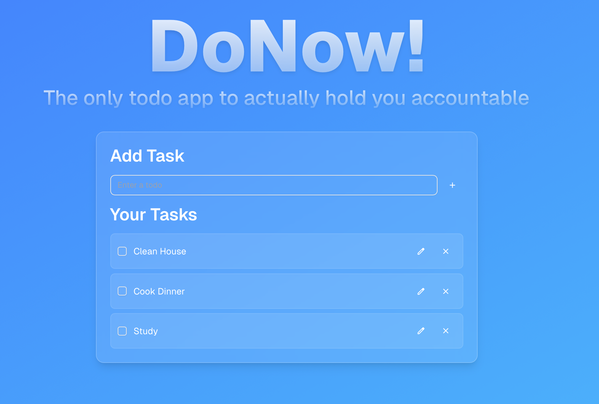

# DoNow!

The greatest todo app of all time.

---

## Features

* **Add Todos** – Enter a task quickly, validated with Zod, and submit.
* **Edit Todos** – Inline modal dialog with full form validation.
* **Delete Todos** – Remove tasks instantly with background server sync.
* **Toggle Complete** – Mark todos complete or incomplete with a checkbox and automatic strikethrough styling.
* **Optimistic UI Updates** – Checkboxes flip instantly on the client side while the database update resolves in the background.
* **Responsive UI** – Beautifully built and highly accessible using Tailwind CSS and shadcn/ui.
