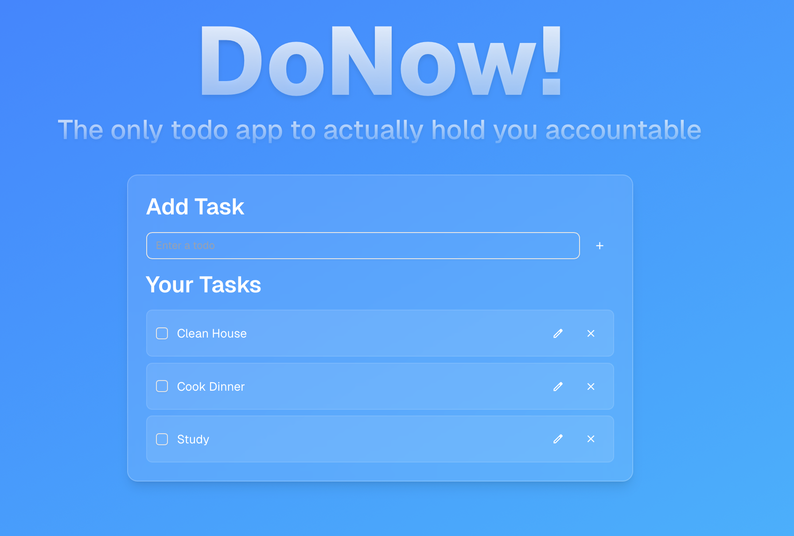

# DoNow!

A simple full-stack Todo application built with **Next.js 15**, **TypeScript**, **Prisma**, and **shadcn/ui**.  

---

## 🚀 Features

- **Add Todos** — enter a task, validate with Zod, and submit.
- **Edit Todos** — inline modal dialog with form validation.
- **Delete Todos** — remove instantly with server sync.
- **Toggle Complete** — mark todos complete/incomplete with a checkbox and strikethrough styling.
- **Optimistic UI** — checkbox updates instantly while persisting in the database.
- **Responsive UI** — styled with Tailwind + shadcn/ui.

---

## 🛠️ Tech Stack

-   
-   
-   
-   
-   

